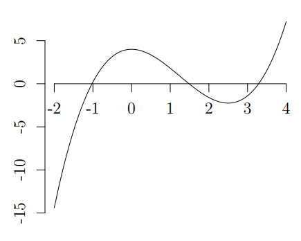
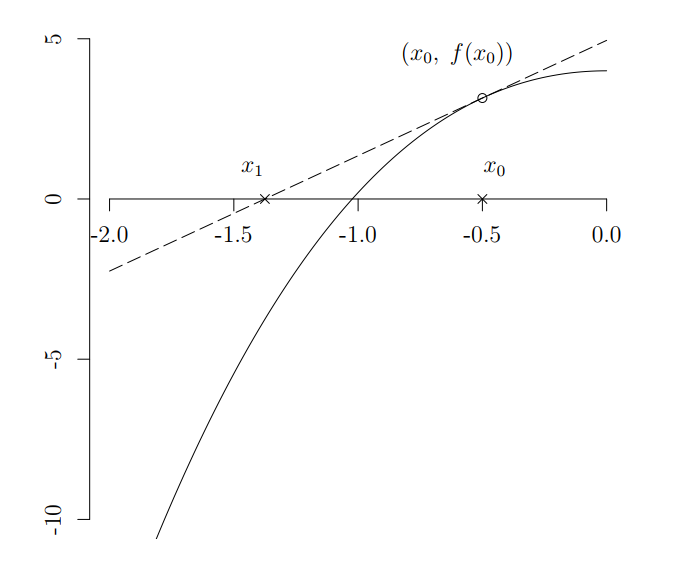
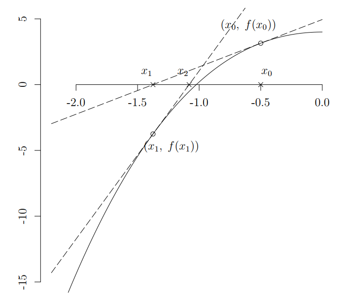

# Constructing Iteration Function

Let $$f(x)=0.8x^3-3x^2+4$$ be the unknown function where we want to find one of its roots. We may start by looking on to the function:

<figure style="text-align:center;s">
    
</figure>
 

We can see there are 3 roots of the function. The smallest root is near -1, which will be the target of our method. Let's zoom in to the target:

<figure style="text-align:center;">
    
</figure>
 

Assume that we have no knowledge about the above graph. Let $$x_0=-0.5$$ be our initial guess of the root. From it we get $$f(x_0)=3.15$$.

<figure style="text-align:center;">
    
</figure>
 

Now, let $$f'$$ be the first derivative of $$f$$. In this case, $$f'(x)=2.4x^2-6x$$. Then $$f'(x_0)$$ is the gradient of a line that coincides with point $$(x_0,f(x_0))$$. We can derive the line equation from the coincidence point and the gradient $$f'(x_0)$$:

$$
y(x)=f'(x_0)x + (f(x_0) - f'(x_0)x_0)
$$

Now we plot this line and see what it does:

<figure style="text-align:center;">
    
</figure>
 

After looking at the graph, we find that the line intersects $$y=0$$ at $$x_1$$. The value of $$x_1$$ can be calculated by substituting $$y(x_1)=0$$ to the line equation above:  

$$
\begin {aligned}
    0&=f'(x_0)x_1 + (f(x_0) - f'(x_0)x_0) \\ \\
    x_1&=x_0 - \frac{f(x_0)}{f'(x_0)} \qquad (1)
\end {aligned}  
$$

The Newton's Method says that $$x_1$$ is a better approximation to the root than $$x_0$$. Now we reuse the same steps of getting $$x_1$$ from $$x_0$$, to get $$x_2$$ from $$x_1$$:

<figure style="text-align:center;">
    
</figure>
 

We shall zoom in a bit:

<figure style="text-align:center;">
    
</figure>
 

We see that $$x_2$$ is far closer to the root. From here we can start to construct the iteration function $$I(x)$$ based on how we get $$x_1$$ and $$x_2$$. From our line equation that coincides $$(x_1, f(x_1))$$ we can get $$x_2$$ by:

$$
x_2=x_1 - \frac{f(x_1)}{f'(x_1)} \qquad (2)
$$

and from eq.(1) and eq.(2) we can generalize into the Newton-Raphson method:

$$
x_{i+1}= \left\{ x_i - \frac{f(x_i)}{f'(x_i)} \right\}_{I(x)} \qquad (3)
$$

Next, we can find $$x_3$$ by eq.(3):

$$
x_3=x_2 - \frac{f(x_2)}{f'(x_2)}=-1.025474
$$

<figure style="text-align:center;">
    
</figure>
 

We see that $$x_3$$ is getting closer to the real root! We can continue to iterate $$n$$ times until $$x_n$$ is close enough to the root ($$f(x_n)$$ is close to zero).
